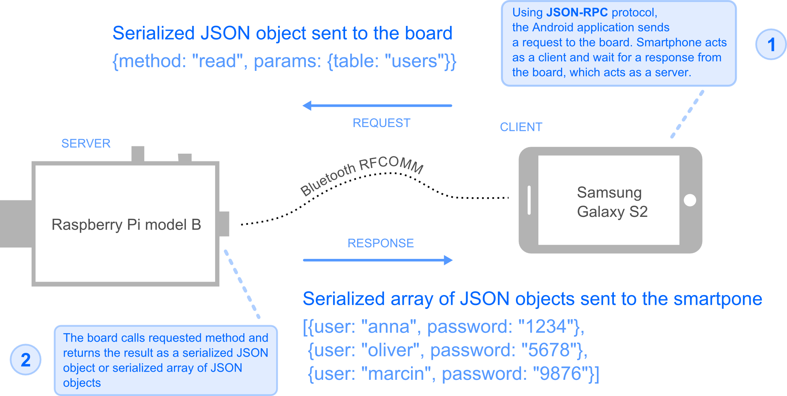
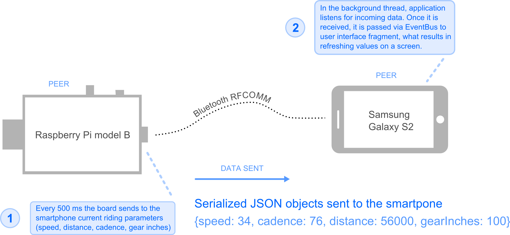
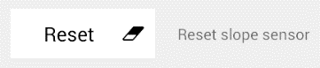
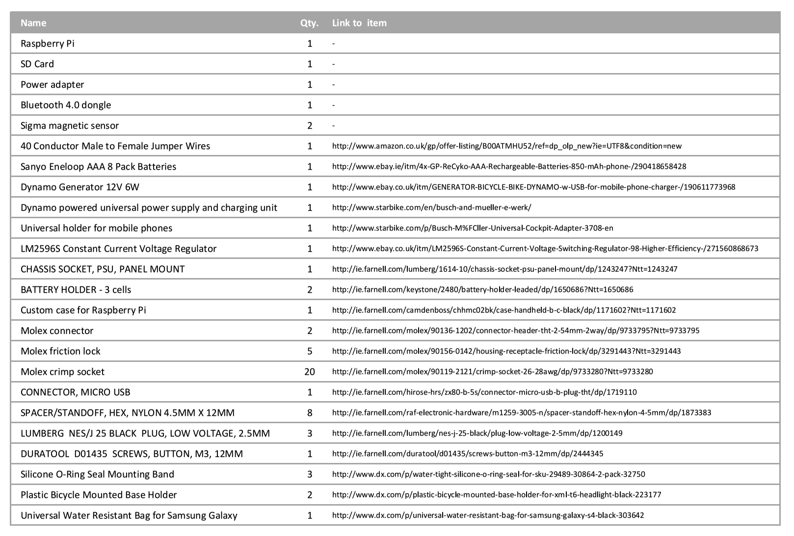

 
 

# 1. System description

The system developed by the author is the system for cyclists, which allow them to monitor the cyclist parameters (speed, distance, cadence, calories usage, trip time).
A cyclist can view those parameters on his smartphone. In order to view such data, cyclist needs to install an Android application. The name of the application is Cyclist Assistant. As the name suggest, application provides some assistance during cycling. The assistance in this context are messages displayed on smartphone’s screen, suggesting the cyclist gear usage, depending on various factors. Those factors are a bicycle type, a current gear, a current slope of the terrain. The application offers cyclists an additional functionality. Cyclist can create multiple accounts, add multiple bicycles and view statistics of a current and all trips.

# 2. Software implementation

The whole system for cyclist consist of the Android application, running on a smartphone and server application running on a computer platform, placed on a bicycle. Android application is written in Java language. Server application is written in JavaScript, which runs with NodeJS – cross-platform runtime environment for server-side and networking application”.

The name of a computer platform is RaspberryPi – system on chip platform.

Android application communicates with server application via Bluetooth RFCOMM protocol. Messages are serialized JSON objects. JSON objects sent from smartphone application contain method name to be invoked on a RaspberryPi and additional parameters. The structure of JSON object complies with JSON-RPC specification. Server application binds with SQLite3 database and uses third party libraries for serial port and GPIO access.

## 2.1 Architectural patterns

In different cases the smartphone and the RaspberryPi board can be seen as a client and server or as two peers.

### 2.1.1 Client – Server

### 2.1.2 Peer to Peer

## 2.2 Application features

After launching the application, it checks, does the smartphone, on which the application is running, have Bluetooth module. If module is not available, dialog informing user, that application cannot function properly, will appear. Otherwise, if Bluetooth is available, application enables it in background. After enabling Bluetooth, process of establishing connection to the server on RaspberryPi board starts:

Problem with server (RaspberryPi is disabled or RaspberryPi is enabled, but server did not start yet) will cause an error and displaying message, as shown below:

If connection with server was established, proper message informs user about that fact:

### 2.2.1 New user

After application established connection with the server, user can login or create new account (add new user).
New user form is divided into two sections: a profile and a bicycle. 

Profile section contains fields for entering username, password and user’s weight. 
Correct weight is needed for calculating calories consumption, during bicycle rides.

Bicycle section allows to enter all relevant information about user’s bicycle. 
After logging in, user can add more bicycles, so specifying name of bicycles, by populating bicycle name field let user distinguish multiple bicycles.

Selecting bicycle type is needed for algorithm generating gear usage suggestions and speed warnings.

Entering bicycle weight is needed for correct calculation of calories consumed by user.

After selecting rim type and tire size, wheel perimeter field is populated with relevant value, so user does not have to measure his bicycle’s wheel perimeter.

Correct wheel perimeter is needed for speed calculation.

Wheel perimeter field is editable, so user can change the value, even after the value was inserted into that field automatically.

All those fields are visible below:

### 2.2.2 Login

On the login form, user enters his username, password and selects one bicycle from the list of his all bicycles.

Username has to be entered in a first place, so that bicycle list can be generated in the background:

### 2.2.3 Dashboard

Dashboard is the graphical interface, displaying multiple parameters during bicycle trip (ride). All those parameters relates to *current* bicycle trip and are present in picture below:

After pressing circle button with horizontal bars, we can see the menu dialog:

**Speed**

When a magnet attached to a spoke passes speed sensor, placed on bicycle it is understood as one bicycle wheel’s rotation.

Speed is calculated using formula discussed in section **2.3.2.**

Speed unit is km/h.

Speed is calculated on RaspberryPi:

> SpeedSensor**.prototype.**calculateSpeed **=** **function()**
>
> **{**
>
> **return** **(this.**perimeter **/** **this.**getTickTime**())** **\*** 3.6**;**
>
> **};**

**Cadence**

When a magnet attached to crank’s arm passes cadence sensor, placed on bicycle it is understood as one bicycle crank’s revolution. Cadence is number of such revolutions per minute.

Cadence unit is rpm.

Cadence is calculated on RaspberryPi:

> CadenceSensor**.prototype.**calculateCadence **=** **function()**
>
> **{**
>
> **return** 60000 **/** **this.**getTickTime**();**
>
> **};**

**Distance**

Distance unit is meter.

Distance is calculated on RaspberryPi:

> //once magnet pass sensor this line of code is executed
>
> classScope**.**distance **+=** classScope**.**perimeter**;**
>
> //distance is available
>
> SpeedSensor**.prototype.**getDistance **=** **function()**
>
> **{**
>
> **return** **this.**distance **/** 1000**;**
>
> **};**

**Gear inches**

Gear inches is dimensionless. It is ratio.

Gear inches are calculated on RaspberryPi:

> **function** calculateGearInches**(**speed**,** cadence**)**
>
> **{**
>
> **var** gearInches **=** **(**speed **\*** 656.167979**)** **/** **(**cadence **\*** Math**.**PI**);**
>
> **if** **(**gearInches **===** Infinity **||** isNaN**(**gearInches**))**
>
> **{**
>
> gearInches **=** 0**;**
>
> **}**
>
> **return** gearInches**;**
>
> **}**

**Slope**

Slope is calculated on the smartphone, using accelerometer and magnetometer sensor.

Slope unit is percent \[%\].

**Calories**

Calories are calculated using formula described in section **2.3.3**

Calorie unit is Kcal.

Calories are calculated on the smartphone, because they depend on slope value, which can only be calculated on the smartphone.

**
**

**
**

**Gear icon and corresponding message**

Each bicycle type has set in code recommended gear inches ranges for different type of slopes. These information and current slope and gear inches are compared every 500ms and result of the comparison are three possible messages:

> - Use lower gear
>
> - Use higher gear
>
> - You are using optimal gear

**Cadence icon and corresponding message**

Experience of many cyclists indicates that optimal cadence range is 70 – 100.

(http://inl.org/cycling/advice/cadence/)

Function responsible for cadence messages, returns three possible messages:

-   If current cadence is less than 70: Cadence is to low

-   If current cadence is between 70 and 100: Cadence is optimal

-   If current cadence is greater than 100: Cadence is to high

**Calories icon**

When icon is red, calories are actively consumed (cyclist is pedalling).

When icon is green calories are not actively consumed (cyclist is not pedalling, but bicycle is going).

**Speed warning icon and corresponding message**

Each type of bicycle has speed limit specified. If current bicycle speed is greater than the limit, then speed warning message appears and speed icon becomes red.**
**

1.  **Statistics**

Statistics are divided into two sections: current bicycle trip and all bicycles trip. Current bicycle trip section contains trip time, average speed, max speed and max cadence.

All bicycle trips sections contains all above mentioned parameters, as well as total distance.

**
**

1.  **Settings**

Settings are divided into four sections: currently selected bicycle’s, bicycles’, cyclist’s profile and slope sensor’s section. All settings are discussed in details in sections A – F.

1.  **Bicycle is loaded with bags**

Toggle allowing user to select whether his bicycle is loaded with bags or not. This setting reflects displaying gear usage suggestions and cyclist’s calories consumption.

When bicycle is loaded with bag it is heavier. This fact causes that calories consumption is higher and “use lower gear” suggestion will appear earlier on less steep terrain.

1.  **Change bicycle**

Field allowing user to change his current bicycle. (Assuming system is enabled and user placed RaspberryPi board and smartphone on another bicycle).

After touching the field, confirmation dialog showed in

**Picture 2.5** appears. When user will touch **No** dialog will be closed and no further action will be taken.

When user will touch **Yes**, dialog with bicycles list of current user will appear, as it is showed in **Picture 2.6**.

After selecting certain bicycle dashboard and statistics of
current trip will be reset. Server on RaspberryPi will start
measuring parameters taking into account details of newly
selected bicycle (wheel perimeter, bicycle type and weight).

1.  **Manage bicycles**

Manage bicycles form allows user to add new bicycles, edit and remove
existing ones. User can open this form, by touching **Manage** button (**Picture 2.7**).
Bicycle marked as green is currently selected.

> 

**
**

1.  **Show tabs names**

User can decide, whether tabs names should be visible or not. When they are visible, then currently visible tab is highlighted. Tabs names are also touchable.
Hiding tabs, user can gain some space for the graphical interface.

1.  **Edit profile**

User has got an option for editing his profile.
In order to open edit form, he has to touch
**Edit** button (**Picture 3.2**)

**
**

1.  **Remove profile**

User has got an option to remove his profile. After touching remove button, profile, statistics and all bicycles of current user will be removed. After successful removal,
the screen in **Picture 3.7** is visible.

1.  **Calibrate slope sensor**

Slope sensor is a simplification for the accelerometer and magnetometer sensors, located in a smartphone, which are used to calculate the slope of a terrain. Slope is based on the position of a smartphone. When user place the smartphone on his bicycle’s handlebar, accelerometer and magnetometer sensors can be used to calculate a slope of a terrain.

User, in order to see the screen of the smartphone, during cycling, will place it at certain angle. Such angle will false the real slope of a terrain. Calibrate function is available in order to provide the correct value of a slope, even if the smartphone is placed on a handlebar at an angle. Before a user can calibrate the slope sensor, he needs to make sure that the smartphone is placed at the right, comfortable angle and the angle won’t be changed during cycling. Once the smartphone is placed correctly, user needs to find perfectly flat area (for example a floor in a house), then he can calibrate the sensor. Calibration will set slope to 0%, previous value will be remembered and subtracted from current value, every time it will change. In other words, percentage offset will be applied.

1.  **Reset slope sensor**

After slope sensor calibration user can always reset slope sensor. Resetting will remove a percentage offset and slope sensor will output the real values.

**
**

## 2. Hardware design

### 2.1 Circuit diagrams**

Circuit diagram on **Figure 1.7** demonstrates the construction of the device capable of doing computation, actuation and sensing. Embedding all electronic components into a bicycle, what are present on the diagram, would make a bicycle the real Thing, according to IoT definition, but for needs of project the author placed them in a plastic case, which is situated on a bicycle’s frame.

**Figures 1.8, 1.9** and **2.0** demonstrates how the device functions in different cases.

On **Figure 1.8**, the device batteries are charged by electrical current source – a dynamo. The device is disabled. Bicycle is going.

On **Figure 1.9** the device is connected with dynamo and is enabled. Batteries are not charged. Bicycle is going.

On **Figure 2.0** the device is enabled and powered by the batteries. Bicycle is not going.

Batteries play important role in the device, because they allow to work the device, regardless of bicycle state (going / not going).

The project required connecting two reed switches into the RaspberryPi board.
The reed switch is an electrical switch operated by an applied magnetic field.

First reed switch is required to monitor speed, distance and time of a bicycle trip.
Second reed switch is required to monitor cadence.
Combination of two reed switches allows also for calculation of gears ratio: gear inches.

**Figure 2.1** is a circuit diagram demonstrating, how reed swithces are connected with the RaspberryPi GPIO.

### 2.2 GPIO**

GPIO is the interface for communication between components of a computer system, such as a microprocessor or various peripherals. Outputs (pins) of such a device can serve both as inputs and outputs and are usually configurable. GPIO pins are often grouped in ports.

1.  **Hardware implementation**

    1.  **Parts**

> Parts used in a project are specified in **Appendix I**.

1.  **RaspberryPi board (computer platform)**

> Project required the author to place the RaspberryPi board in a plastic case, together with the batteries and the voltage regulator. The author had to modify the original cables of reed switches, so that they could be connected to the GPIO pins on the RaspberryPi board. Bluetooth dongle was modified as well – it was soldered with external antenna.
>
> Plastic case was attached to the bicycle.
>
> Reed switches and magnets was placed on the one spoke of front bicycle wheel and on the arm of crank. Cables of reed switches were connected to the plastic case via Molex sockets.
>
> Described photo of the RaspberryPi, connected with another components is in **Appendix IX**.

1.  **Smartphone**

> Smartphone model used in a project was Samsung Galaxy GT-I9100.
>
> The smartphone was placed on a bicycle’s handlebar, in a special holder.

**Appendix I -** List of hardware and parts used in the project

**
**

**Appendix II -** Third party libraries, resources and tools used in

the project

**LIBRARIES**

1.  Android libraries:

    1.  User interface:

        1.  **PagerSlidingTabStrip**

> **“**Interactive paging indicator widget, compatible with the ViewPager from the Android Support Library.**”**
>
> Version: 1.0.9
>
> Page: https://github.com/jpardogo/PagerSlidingTabStrip

1.  **Android-Bootstrap**

> Bootstrap based style for Android
>
> Page: https://github.com/Bearded-Hen/Android-Bootstrap

1.  **AndroidSVG**

> **“**AndroidSVG is a SVG parser and renderer for Android**”**
>
> Version: 1.2.1
> Page: https://code.google.com/p/androidsvg/

1.  **ToggleButton**

> **“**ToggleButton Widget For Android Developers**”**
>
> Page: https://android-arsenal.com/details/1/1158

1.  Utils:

    1.  **EventBus**

> **“**EventBus is publish/subscribe event bus optimized for Android. Simplifies the communication between components**”**
>
> Version: 2.4.0
>
> Page: https://github.com/greenrobot/EventBus

1.  **ButterKnife**

> **“**Field and method binding for Android views which uses annotation processing to generate boilerplate code for you**”**
>
> Version: 6.1.0
>
> Page: https://github.com/JakeWharton/butterknife

1.  JavaScript libraries

    1.  **Justgage**

**“**JustGage is a handy JavaScript plugin for generating and animating nice & clean dashboard gauges. It is based on Raphaël library for vector drawing.**”**

Version: February 16, 2014
Home page: http://justgage.com/\#setup

1.  NodeJS modules:

    1.  **onoff**

**“**GPIO access and interrupt detection with io.js or Node.js on Linux boards like the BeagleBone, BeagleBone Black, Raspberry Pi, or Raspberry Pi 2.**”**

Version: 1.0.2

Page: https://github.com/fivdi/onoff

1.  **serialport**

**“**It provides a very simple interface to the low level serial port code necessary to program Arduino chipsets, X10 wireless communications, or even the rising Z-Wave and Zigbee standards**”**

Version: 1.6.1

Page: https://github.com/voodootikigod/node-serialport

1.  **sqlite3**

**“**Asynchronous, non-blocking SQLite3 bindings for Node.js.**”**

Version: 3.0.5

Page: https://github.com/mapbox/node-sqlite3

**RESOURCES**

1.  SVG icons:

    1.  Page: http://www.flaticon.com/free-icon/mountain-cycling\_37961

Icon made by Freepik from www.flaticon.com

1.  Fonts:

    1.  Home page: http://fortawesome.github.io/Font-Awesome/

**“**Font Awesome gives you scalable vector icons that can instantly be customized: size, color, drop shadow, and anything that can be done with the power of CSS**”**

Version: 4.3.0

**Appendix IX –** Description of RaspberryPi board connected with

other components inside the plastic case

